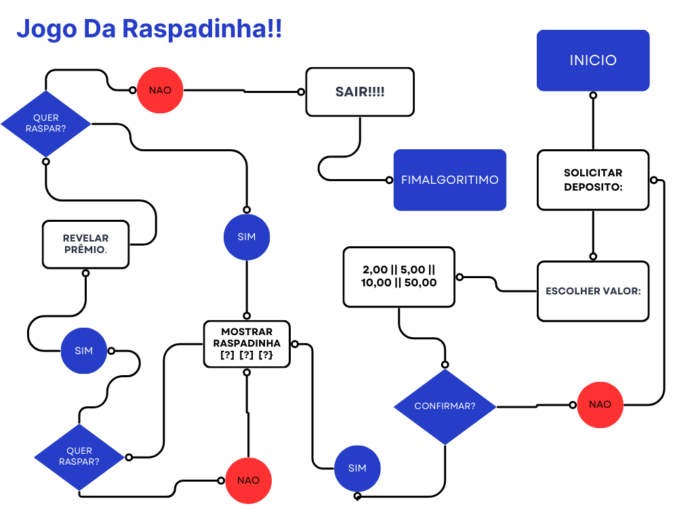

# 📦 Instalação

## Clone o repositório:

`git clone https://github.com/ruivocodespace/raspadinha.git`

`cd raspadinha`

# ▶️ Execução

## Execute o programa principal com o comando:

`python main.py`

# 🗂 Fluxograma

## Abaixo está o fluxograma que descreve o funcionamento geral do sistema:

